# 1. Волосников Владимир Алексеевич ИС22/9-1

## Описание
Эта база данных используется для управления информации о стрижках, товарах и услугах барбершопа.


### Таблица category
 


1)cat_id(id категории, настроен по умолчанию, int)

2)catName(имя категории, text)

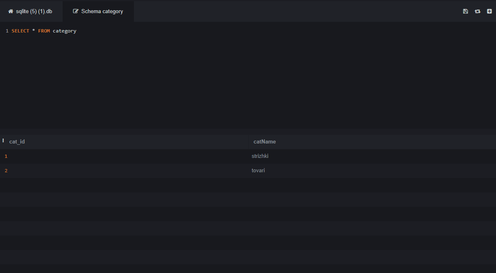

### Таблица tblBasket
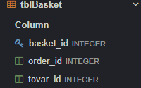


1)basket_id(id корзины с данными, настроен по умолчанию, int)

2)order_id(id заказа, int)

3)tovar_id(id товара или услуги, int)

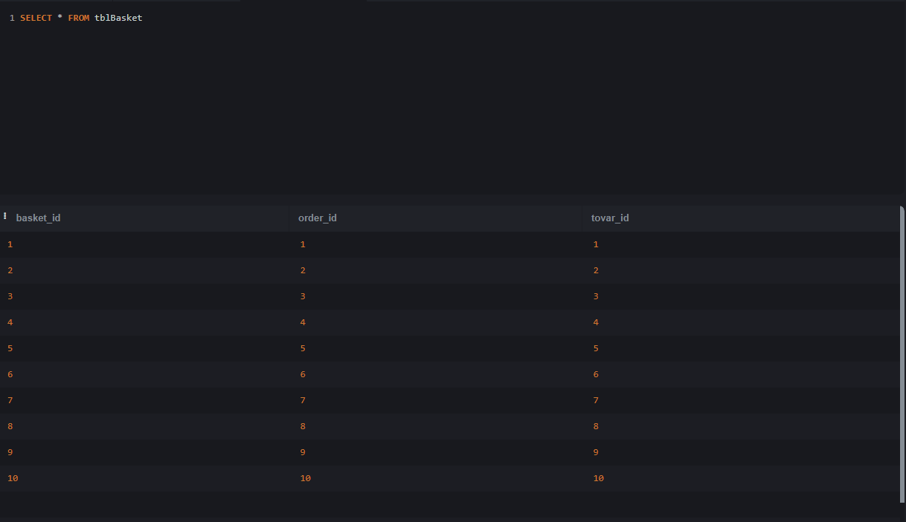

### Таблица tblClient
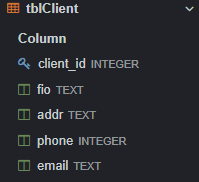


1)client_id(id клиента, настроен по умолчанию, int)

2)fio(ф.и.о. клиента, text)

3)addr(адрес барбершопа в записи, text)

4)email(электронная почта клиента, text)

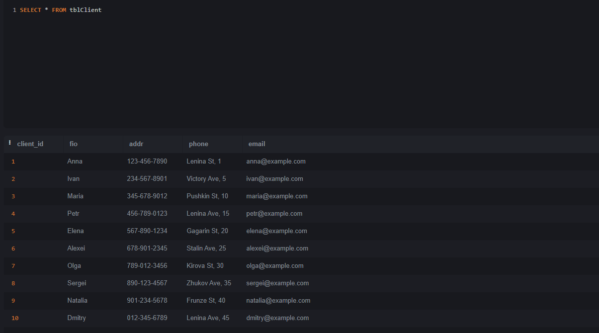


### Таблица tblManager


1)manager_id(id специалиста, настроен по умолчанию, int)

2)fio(ф.и.о. специалиста, text)

3)phone(номер телефона специалиста, text)

4)addr(адрес работы специалиста, text)

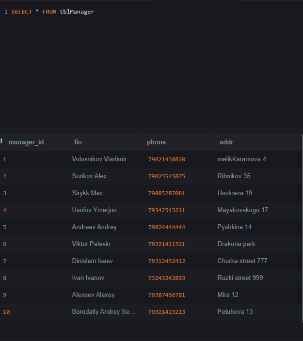


### Таблица tblOrders
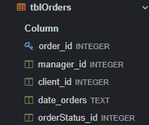


1)order_id(id заказа, настроен по умолчанию, int)

2)manager_id(id специалиста, int)

3)client_id(id клиента, int)

4)date_orders(дата заказа, date)

5)orderStatus_id(id статуса заказа, int)

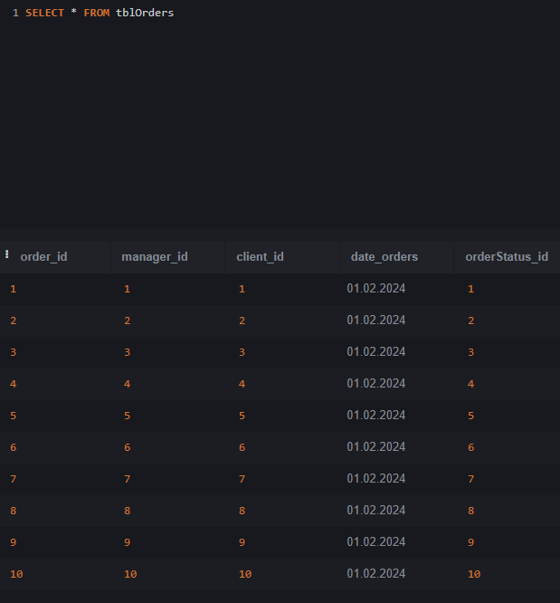


### Таблица tblStatusOrder 
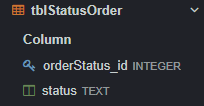


1)orderStatus_id(id статуса заказа, настроен по умолчанию, int)

2)status(статус заказа, text)

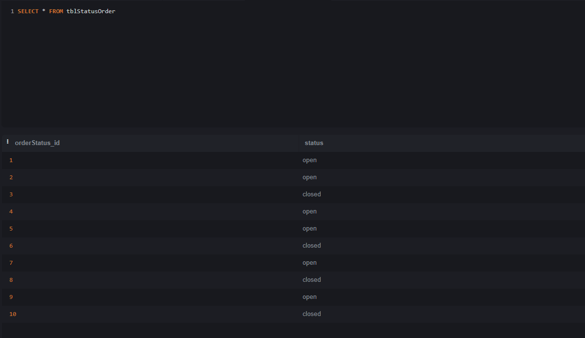

### Таблица Uslugi 
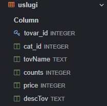


1)tovar_id(id товара или услуги, настроен по умолчанию, int)

2)cat_id(id категории, int)

3)tovName(наименование товара, text)

4)counts(расчет, int)

5)price(прайс, int)

6)descTov(описание товара, text)

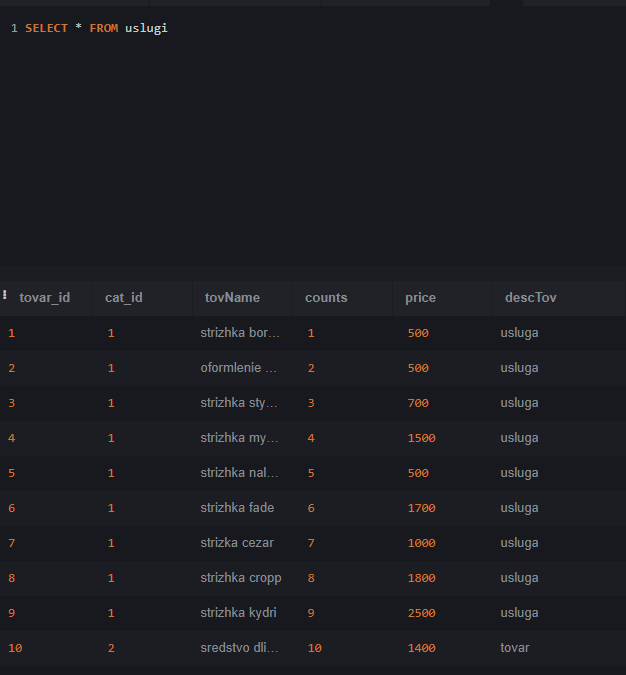


### 3. Функция UNION 
я объеденил два набора значений из двух разных таблиц. Fio из tblClient и fio из tblManager

```
SELECT fio FROM tblCLient
UNION
SELECT fio FROM tblManager
```
Результат: 


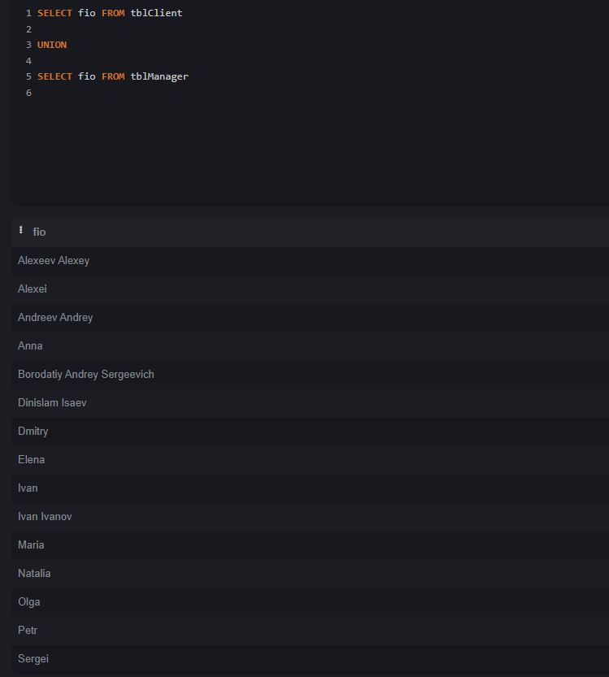


### 4. Функция ORDER BY
Демонстрация Функции сортировки строк.
Сортировка прошлого запроса функцией ORDER BY в алфавитном порядке и по убыванию алфавитного порядка

```
SELECT fio FROM tblCLient
UNION
SELECT fio FROM tblManager
ORDER BY fio ASC
```

```
SELECT fio FROM tblCLient
UNION
SELECT fio FROM tblManager
ORDER BY fio DESC 
```

Результаты: 


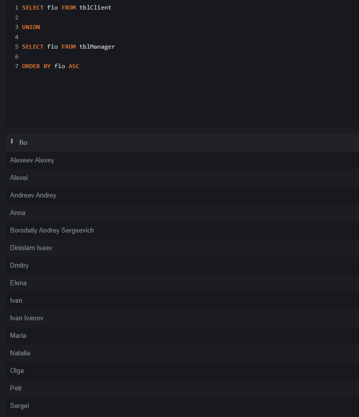


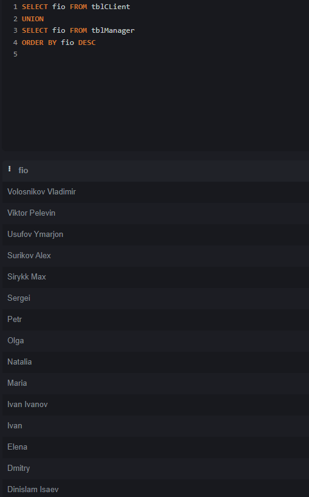


### 5. Функция HAVING 
Функция HAVING и вложенный запрос SELECT выводят максимальный прайс за услугу.

```
SELECT price
FROM uslugi 
GROUP BY tovar_id
HAVING price = (select max(price) from uslugi)
```
результат: 


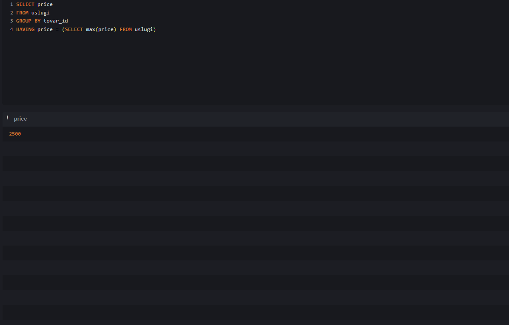


### 6. Демонстрация вложенных запросов

6.1 В SELECT

через вложенный запрос SELECT, выводятся все email, которые начинаются на букву A

```
SELECT (SELECT email FROM tblClient WHERE email like 'a%' ) AS '123' 
FROM tblClient
```
результат: 


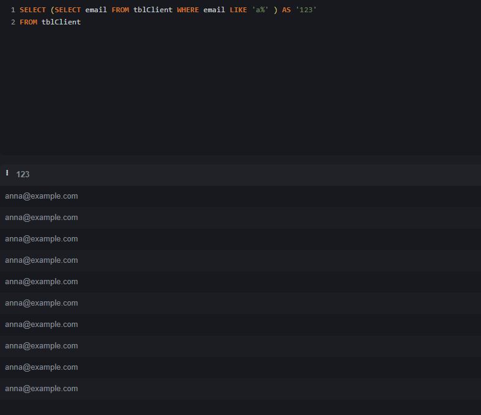

6.2 WHERE
через вложенный запрос WHERE, выводится один email, который начинается на букву И

```
select email
FROM tblClient WHERE email LIKE (SELECT email FROM tblCLient WHERE email like 'i%')
```
результат:


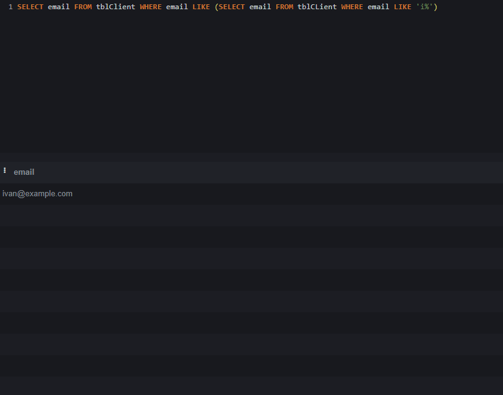

### 7. Агрегатные функции

Через функцию min выводится минимальная длина фамилий в таблице tblManager

```
SELECT Min(length(fio)) AS Минимальная_длин_фамилии
FROM tblManager
```
результат:

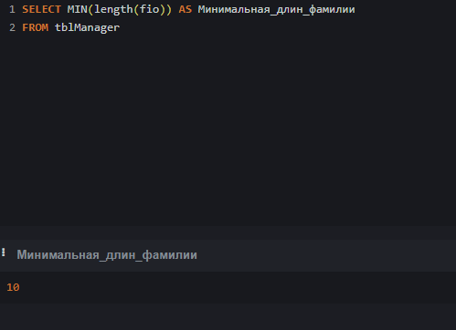

Через функцию MAX выводится максимальная длина фамилий в таблице tblManager

```
SELECT MAX(length(fio)) AS Минимальная_длин_фамилии
FROM tblManager
```

Результат:


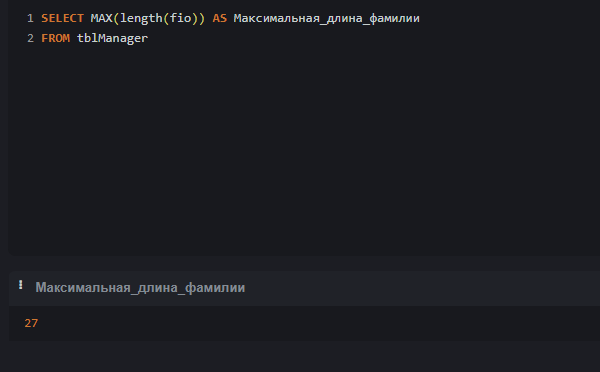

Через COUNT выводится количество фамилий менеджеров

```
SELECT (COUNT(fio)) AS Количество_фамилий_менеджеров
FROM tblManager
```


Результат:


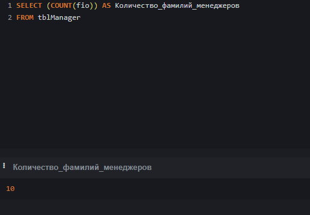

Через функцию AVG выводится средний чек услуг в таблице Uslugi

```
SELECT AVG(price) AS средний_чек_услуг
FROM Uslugi
```
Результат: 


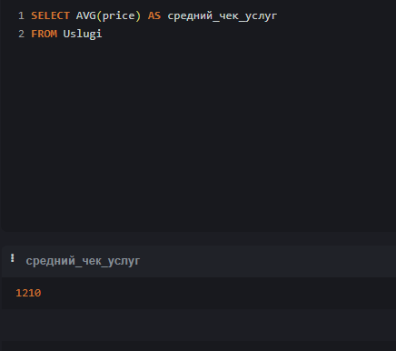


### 8. Соединения JOIN
Через INNER JOIN соеденились две таблицы

```
SELECT tovName, category.cat_id
FROM Uslugi
JOIN category ON uslugi.tovar_id = category.cat_id
```
результат: 


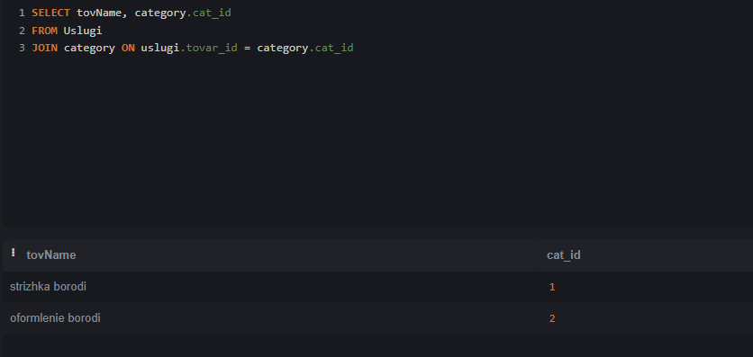

RIGHT JOIN берет все значения из правой таблицы, а из левой только те значения, которые указаны в SELECT

```
SELECT catName, category.cat_id
FROM category
RIGHT JOIN Uslugi ON uslugi.tovar_id = category.cat_id
```
Результат: 


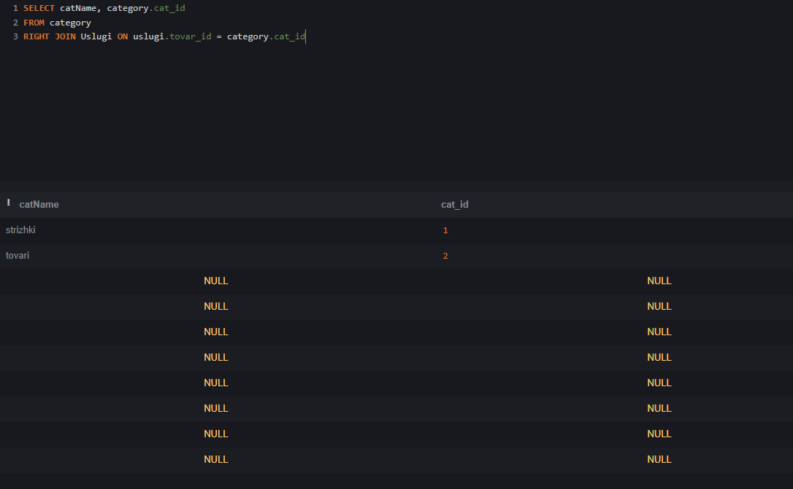

LEFT JOIN берет все значения из левой таблицы, а из правой только те, которые указаны в SELECT

```
SELECT tovName, category.cat_id
FROM Uslugi
LEFT JOIN category ON uslugi.tovar_id = category.cat_id
```
результат: 


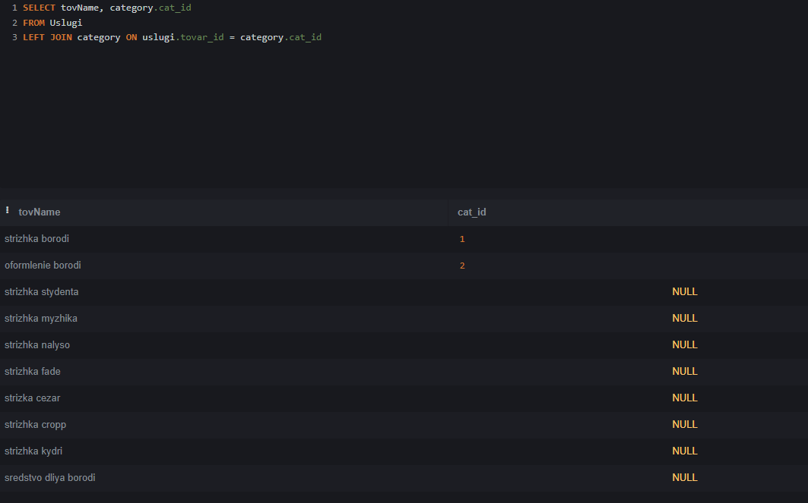


### 9. CASE
Работает как конструкция IF, если условие выполняется, то он выводит результат.

```
SELECT tovName,
CASE
 WHEn tovName = 'strizhka stydenta' THEN 'cтрижка по студенческому билету'
 WHEN tovName = 'strizhka borodi' THEN 'стрижка и оформление бороды'
 ELSE 'Нет акции'
    END AS Акция
    FROM uslugi
```

Результат:


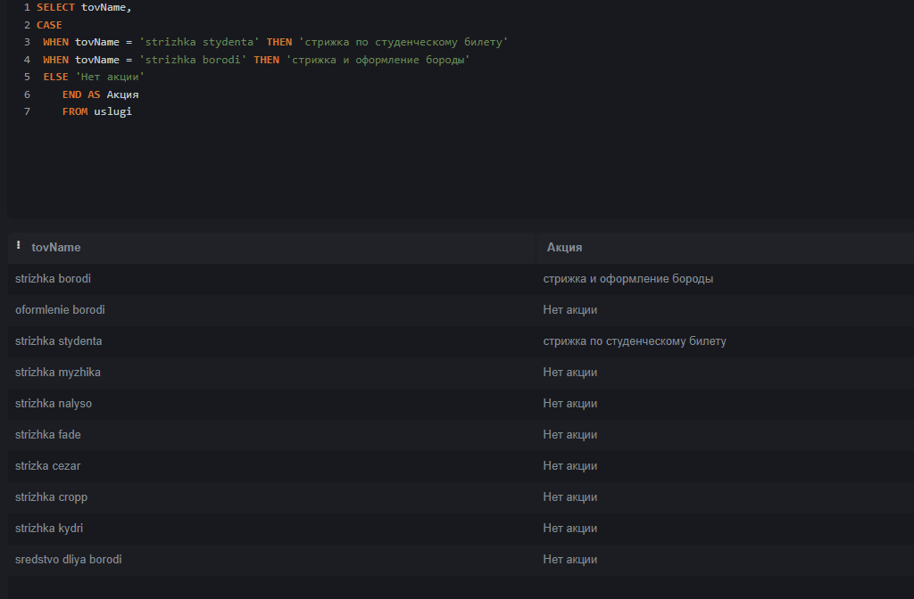


### 9. WITH 
Функция with - это создание временной таблицы. С помощью функции WITH создалась временная таблица, состоящая из значений двух других постоянных таблиц

```
WITH '123' AS
    (SELECT tblClient.phone, tblClient.addr, tblManager.phone, tblManager.addr FROM tblManager
        INNER JOIN tblClient ON tblClient.Client_id = tblManager.manager_id)

SELECT * FROM '123';
```

Результат:


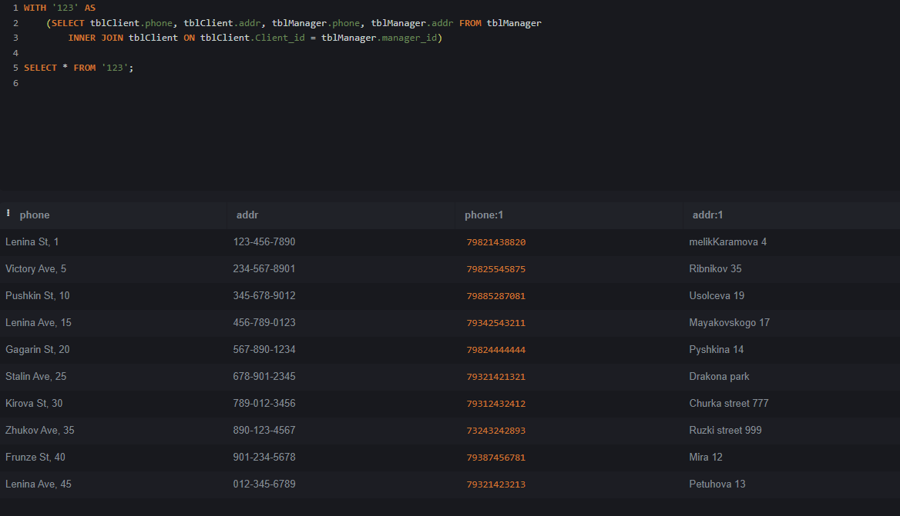
